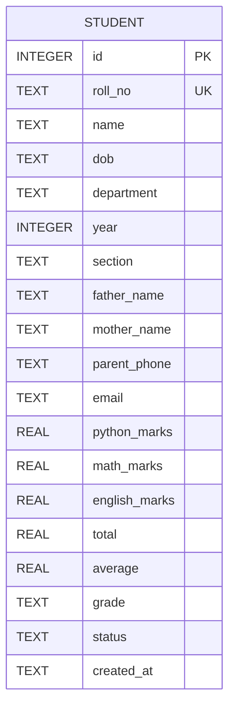
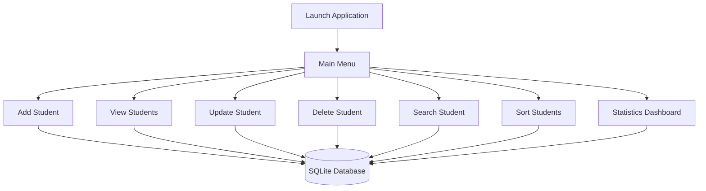
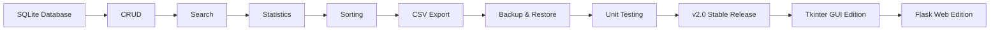

<div align="center">

# 🎓 Student Management System

### Professional Student Management System built with Python & SQLite


<br>


<br><br>


</div>

---

# 📖 About

The **Student Management System** is a console-based application developed entirely in **Python** using **SQLite** as its database engine.

Unlike a simple CRUD project, this application has been designed with a modular architecture that separates the user interface, business logic, validation, and database operations into dedicated components. The primary objective is to learn software engineering principles by building a complete application from scratch while following clean coding practices and version control.

This project demonstrates how a real-world database application can be structured without relying on external frameworks.

---

# ✨ Current Features

## 🎓 Student Management

- ✅ Add Student
- ✅ View Students
- ✅ Update Student Information
- ✅ Delete Student Records
- ✅ Search Students
- ✅ Sort Students
- ✅ Input Validation
- ✅ Dynamic Grade Calculation
- ✅ Automatic Pass / Fail Status

---

## 🗄 Database Features

- ✅ SQLite Database
- ✅ Automatic Database Creation
- ✅ Automatic Table Creation
- ✅ Parameterized SQL Queries
- ✅ Primary Key & Unique Constraints
- ✅ Aggregate SQL Functions
- ✅ Dynamic ORDER BY Sorting
- ✅ Timestamped Records

---

## 📊 Analytics

- ✅ Total Students
- ✅ Highest Average
- ✅ Lowest Average
- ✅ Overall Class Average
- ✅ Grade Distribution
- ✅ Pass / Fail Statistics

---

## 🚧 Coming Soon

- 📄 CSV Export
- 💾 Backup & Restore
- 🧪 Unit Testing
- 📘 Complete Documentation
- 🚀 Stable v2.0 Release

---

# ⚙ Technology Stack

| Technology | Purpose |
|------------|---------|
| 🐍 Python 3 | Core Programming Language |
| 🗄 SQLite | Relational Database |
| 💻 VS Code | Development Environment |
| 🌿 Git | Version Control |
| 🐙 GitHub | Repository Hosting |
| 📝 Markdown | Documentation |

---

# 🏗 Project Architecture

```text
                    Student Management System

                           main.py
                              │
     ┌────────────────────────┼────────────────────────┐
     │                        │                        │
     ▼                        ▼                        ▼
 Input Handling        Business Logic          User Interface
                              │
                              ▼
                     database/database.py
                              │
                              ▼
                     SQLite Database Engine
                              │
                              ▼
                         students.db

              ▲
              │
     ┌────────┴─────────┐
     │                  │
     ▼                  ▼
utils/helpers.py   utils/validator.py

```

---

# 📂 Project Structure

```text
student-management-system/

│
├── backup/
│
├── database/
│   ├── database.py
│   └── students.db
│
├── exports/
│
├── utils/
│   ├── helpers.py
│   └── validator.py
│
├── config.py
├── main.py
├── README.md
├── LICENSE
├── CHANGELOG.md
├── requirements.txt
└── .gitignore
```

---

# 🗄 Database Schema



---

# 📈 Current Project Status

| Module | Status |
|:------------------------------|:------:|
| 🏗 Project Structure | ✅ Complete |
| 🗄 SQLite Integration | ✅ Complete |
| ➕ CRUD Operations | ✅ Complete |
| 🔍 Search System | ✅ Complete |
| 📊 Statistics Dashboard | ✅ Complete |
| 🔄 Sorting System | ✅ Complete |
| ✔ Validation System | ✅ Complete |
| 📄 CSV Export | 🚧 In Progress |
| 💾 Backup & Restore | ⏳ Planned |
| 🧪 Unit Testing | ⏳ Planned |

---

<div align="center">

## 🚀 Version

### **v2.0.0-alpha**

**Building a professional Student Management System one feature at a time.**

</div>

---
# 🚀 Installation

## Clone the Repository

```bash
git clone https://github.com/soumith-64/student-management-system-python.git
```

---

## Navigate to the Project

```bash
cd student-management-system-python
```

---

## Run the Application

```bash
python main.py
```

---

## Requirements

- Python 3.10+
- SQLite3 (Built into Python)
- Visual Studio Code (Recommended)

---

# 🖥 Application Workflow



---

# 📸 Application Preview

> Screenshots will be added after the completion of Version 2.0.

<div align="center">

| Main Menu | Add Student |
|------------|-------------|
| 🚧 Coming Soon | 🚧 Coming Soon |

| Search | Statistics |
|----------|------------|
| 🚧 Coming Soon | 🚧 Coming Soon |

| Sorting | Update |
|----------|---------|
| 🚧 Coming Soon | 🚧 Coming Soon |

</div>

---

# 🧠 Concepts Demonstrated

## 🐍 Python

- Functions
- Modular Programming
- Exception Handling
- User Input Handling
- Data Validation
- Helper Functions
- File Organization
- Code Reusability

---

## 🗄 SQLite

- Database Design
- CREATE TABLE
- INSERT
- SELECT
- UPDATE
- DELETE
- WHERE Clause
- ORDER BY
- Aggregate Functions
- Constraints
- Transactions
- Parameterized Queries

---

## 📊 SQL Concepts

- COUNT()
- MAX()
- MIN()
- AVG()
- ORDER BY
- LIKE
- WHERE
- PRIMARY KEY
- UNIQUE
- DEFAULT
- AUTOINCREMENT

---

## 💻 Software Engineering

- Modular Architecture
- Separation of Concerns
- Clean Code Principles
- Reusable Components
- Version Control
- Incremental Development
- Documentation
- Error Handling

---

# 📊 Development Progress

<div align="center">

| Feature | Progress |
|----------|:--------:|
| 🏗 Project Structure | ██████████ 100% |
| 🗄 SQLite Database | ██████████ 100% |
| ➕ CRUD Operations | ██████████ 100% |
| 🔍 Search Module | ██████████ 100% |
| 📊 Statistics Dashboard | ██████████ 100% |
| 🔄 Sorting System | ██████████ 100% |
| ✔ Validation Module | ██████████ 100% |
| 📄 CSV Export | ░░░░░░░░░░ 0% |
| 💾 Backup System | ░░░░░░░░░░ 0% |
| 🧪 Unit Testing | ░░░░░░░░░░ 0% |

</div>

---

# 🎯 Current Milestone

```text
██████████████████████████████████████████████░░

Overall Progress : 92%

Current Version : v2.0.0-alpha

Next Feature : CSV Export

Estimated Stable Release : v2.0.0
```

---

# 🛣 Development Roadmap



---

# 🚀 Future Versions

| Version | Description | Status |
|----------|-------------|:------:|
| v1.0 | Text File Based Student Management System | ✅ Released |
| v2.0 | SQLite Database Edition | 🚧 In Development |
| v3.0 | Object-Oriented Refactoring | ⏳ Planned |
| v4.0 | Tkinter Desktop GUI | ⏳ Planned |
| v5.0 | Flask Web Application | ⏳ Planned |
| v6.0 | REST API & Authentication | 🔮 Future |

---

# 🏆 Skills Demonstrated

<div align="center">

| Programming | Database | Engineering |
|--------------|----------|-------------|
| Python | SQLite | Clean Architecture |
| SQL | CRUD | Modular Design |
| Exception Handling | Database Design | Documentation |
| Validation | Aggregate Queries | Git Workflow |
| Functions | Parameterized SQL | Problem Solving |

</div>

---

# 📌 Repository Highlights

✨ Beginner Friendly

✨ Clean Folder Structure

✨ Professional Documentation

✨ SQLite Powered

✨ Modular Design

✨ Input Validation

✨ Dynamic Sorting

✨ Statistics Dashboard

✨ Open Source

✨ MIT Licensed

---

# 🎖 Project Philosophy

> **"Learning by building."**

This repository is more than a Student Management System.

It represents a journey of learning software engineering through practical development.

Every feature has been implemented from scratch, committed individually, and documented to demonstrate both programming skills and project organization.

Rather than relying on external frameworks, the project focuses on understanding core Python, SQL, and software engineering principles that form the foundation of larger applications.

---
# 🤝 Contributing

Contributions are welcome and greatly appreciated!

If you'd like to improve this project:

1. Fork the repository
2. Create your feature branch

```bash
git checkout -b feature/amazing-feature
```

3. Commit your changes

```bash
git commit -m "feat: add amazing feature"
```

4. Push to your branch

```bash
git push origin feature/amazing-feature
```

5. Open a Pull Request

---

# 🐛 Reporting Issues

Found a bug or have a suggestion?

Please create an Issue including:

- A clear description
- Steps to reproduce
- Expected behavior
- Screenshots (if applicable)
- Python version

Your feedback helps improve the project for everyone.

---

# 📚 Learning Journey

This repository represents my journey of learning software engineering through hands-on development.

Rather than building a project as quickly as possible, every feature has been developed incrementally to understand the concepts behind it.

Throughout this project I have explored:

- Python Programming
- SQLite Database Design
- SQL Query Writing
- Data Validation
- Modular Programming
- Software Architecture
- Git & GitHub Workflow
- Technical Documentation

Each feature was implemented only after understanding the underlying concepts, making this repository both a functional application and a record of continuous learning.

---

# 📊 Repository Statistics

<div align="center">

| Category | Status |
|-----------|:------:|
| Python | ✅ |
| SQLite | ✅ |
| SQL | ✅ |
| CRUD | ✅ |
| Search | ✅ |
| Sorting | ✅ |
| Statistics | ✅ |
| Validation | ✅ |
| Documentation | ✅ |
| Open Source | ✅ |

</div>

---

# 🗂 Repository Standards

✔ Clean Folder Structure

✔ Modular Architecture

✔ Consistent Naming

✔ Meaningful Commit History

✔ Parameterized SQL Queries

✔ Comprehensive Documentation

✔ MIT License

✔ Version Controlled Development

✔ Beginner Friendly

---

# 🎯 Future Goals

This project will continue evolving beyond Version 2.

### Planned Enhancements

- 📄 CSV Export
- 💾 Backup & Restore
- 🧪 Unit Testing
- 📑 PDF Report Generation
- 🖥 Tkinter GUI
- 🌐 Flask Web Application
- 🔑 User Authentication
- 🌍 REST API
- ☁ Cloud Database Support

---

# 📜 Version History

| Version | Status | Description |
|----------|:------:|-------------|
| **v1.0.0** | ✅ Released | Text File Based Student Management System |
| **v2.0.0-alpha** | 🚧 Current | SQLite Edition |
| **v2.0.0-beta** | ⏳ Planned | CSV Export & Backup |
| **v2.0.0** | 🚀 Upcoming | Stable Release |
| **v3.0** | 🔮 Future | Object-Oriented Edition |
| **v4.0** | 🔮 Future | Tkinter GUI |
| **v5.0** | 🔮 Future | Flask Web Application |

---

# 👨‍💻 About the Developer

<div align="center">

## Soumith J.V.

### Python Developer • Computer Science Student • Open Source Learner

Passionate about building complete software projects from scratch while learning professional software engineering principles.

Currently exploring:

🐍 Python

🗄 SQLite

💾 Database Systems

⚙ Software Engineering

🌐 Backend Development

🚀 Open Source

---

### 🌐 Connect With Me

<a href="https://github.com/soumith-64">

</a>

<a href="https://www.linkedin.com/in/soumith-j-v-56042b407/">

</a>

</div>

---

# 🌟 Support the Project

If you found this project useful or learned something from it, please consider giving it a ⭐ on GitHub.

It motivates me to continue building, improving, and sharing open-source projects.

---

# 🙏 Acknowledgements

Special thanks to the amazing communities and tools that made this project possible.

- 🐍 Python Software Foundation
- 🗄 SQLite Developers
- 🌿 Git
- 🐙 GitHub
- 💻 Visual Studio Code
- 🌍 Open Source Community

---

# 📄 License

This project is licensed under the **MIT License**.

See the **LICENSE** file for more information.

---

<div align="center">


---

# ⭐ Student Management System

### Built with ❤️ using Python & SQLite


---

### ⭐ Thank you for visiting my repository!

**Happy Coding! 🚀**

© 2026 **Soumith J. V.**

</div>
