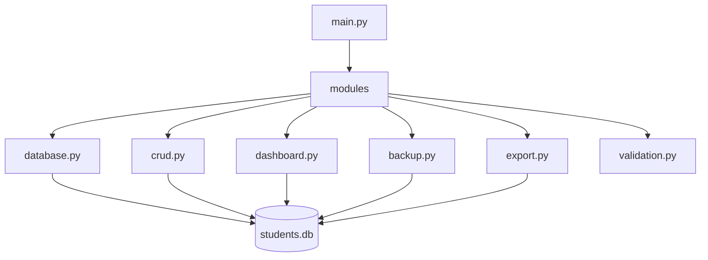
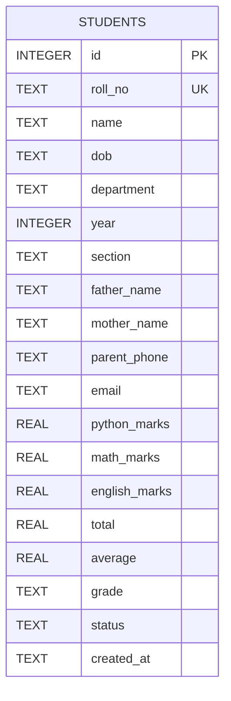
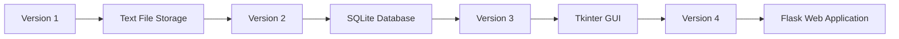
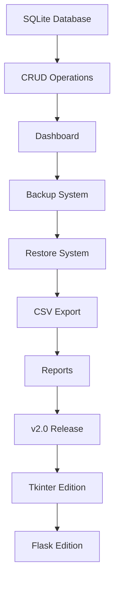

<div align="center">

# 🚀 Student Management System - SQLite Edition

### Professional Python Database Management System


<br>


</div>

---

# 📖 About the Project

Student Management System – SQLite Edition is the second generation of my Student Management System project.

Unlike Version 1, which stored data using text files, this version introduces a **real relational database (SQLite)** while following professional software engineering practices such as modular programming, reusable components, clean project architecture, and Git version control.

The goal of this project is not only to build a functional student management application but also to gain hands-on experience with real-world backend development concepts.

---

# ✨ Project Goals

- Learn SQLite from scratch
- Practice SQL queries using Python
- Build a modular application architecture
- Replace file handling with a relational database
- Improve code quality and maintainability
- Follow professional Git workflow
- Prepare for GUI and Web versions

---

# ⚡ Current Development Status

| Module | Status |
|:--------------------------|:------:|
| 📁 Project Structure | ✅ Completed |
| 🗄 SQLite Database | 🚧 In Progress |
| ➕ Add Student | ⏳ Planned |
| 🔍 Search Student | ⏳ Planned |
| ✏ Update Student | ⏳ Planned |
| ❌ Delete Student | ⏳ Planned |
| 📊 Dashboard | ⏳ Planned |
| 💾 Backup System | ⏳ Planned |
| 📄 CSV Export | ⏳ Planned |
| 🧪 Testing | ⏳ Planned |

---

# 🏗️ Project Architecture



---

# 🗂 Project Structure

```text
student-management-system-sqlite/

├── backup/
├── database/
│   └── students.db
├── exports/
├── modules/
│   ├── __init__.py
│   ├── database.py
│   ├── crud.py
│   ├── dashboard.py
│   ├── backup.py
│   ├── export.py
│   └── validation.py
├── screenshots/
├── main.py
├── config.py
├── README.md
├── CHANGELOG.md
├── LICENSE
├── requirements.txt
└── .gitignore
```

---

<div align="center">

## 🚧 Version 2 Development Roadmap

| Phase | Status |
|:------|:------:|
| Database Design | 🚧 |
| CRUD Operations | ⏳ |
| Dashboard | ⏳ |
| Backup & Restore | ⏳ |
| CSV Export | ⏳ |
| Reports | ⏳ |
| Final Release | ⏳ |

</div>

---

> **💡 This repository is being developed step by step as a learning project. Every feature is implemented incrementally and committed individually to demonstrate a real software development workflow.**

---
# ✨ Features

## 🎓 Student Management

- ➕ Add new students
- 🔍 Search students by Roll Number
- ✏️ Update student information
- ❌ Delete student records
- 📋 View all students

---

## 🗄 Database Features

- SQLite Database
- Automatic Database Creation
- Automatic Table Creation
- Primary Key & Unique Constraints
- Default Values
- Data Validation
- Secure Parameterized SQL Queries

---

## 📊 Analytics

- Total Students
- Department-wise Statistics
- Average Marks
- Highest Scorer
- Lowest Scorer
- Pass / Fail Analysis
- Grade Distribution

---

## 💾 Backup & Recovery

- Manual Backup
- Automatic Backup
- Restore Database
- Timestamped Backups

---

## 📄 Export

- CSV Export
- Excel Compatible Output
- Data Sharing

---

# 🗃 Database Schema



---

# ⚙ Technology Stack

| Technology | Purpose |
|------------|---------|
| Python 3 | Programming Language |
| SQLite | Database |
| SQL | Data Query Language |
| Git | Version Control |
| GitHub | Repository Hosting |
| VS Code | Development Environment |

---

# 📦 Installation

## Clone Repository

```bash
git clone https://github.com/soumith-64/student-management-system-sqlite.git
```

---

## Enter Project Folder

```bash
cd student-management-system-sqlite
```

---

## Run Application

```bash
python main.py
```

---

# 📂 Folder Responsibilities

| Folder | Purpose |
|----------|---------|
| backup | Stores database backups |
| database | SQLite database files |
| exports | CSV exports |
| modules | Application modules |
| screenshots | Project images |

---

# 📜 Module Overview

| Module | Responsibility |
|----------|---------------|
| database.py | Database connection & initialization |
| crud.py | CRUD Operations |
| dashboard.py | Statistics & Reports |
| backup.py | Backup & Restore |
| export.py | CSV Export |
| validation.py | Input Validation |

---

# 🧠 Why SQLite?

Version 1 stored student records in plain text files. While that approach was excellent for learning file handling, it has limitations such as slower searching, manual parsing, and limited scalability.

SQLite provides a real relational database engine that supports structured storage, efficient searching, data integrity, and SQL queries while requiring no external installation.

This makes it the perfect next step for learning professional backend development.

---

# 🔄 Project Evolution



---

<div align="center">

## 🚀 Current Goal

**Build a professional SQLite-powered Student Management System while learning software engineering principles through real-world development.**

</div>

---
# 📸 Application Preview

> Screenshots will be updated as new features are completed.

<div align="center">

| Main Menu | Add Student |
|------------|-------------|
|  |  |

| Search Student | Update Student |
|----------------|----------------|
|  |  |

| Delete Student | Dashboard |
|----------------|-----------|
|  | 🚧 Coming Soon |

</div>

---

# 📚 Concepts Learned

This project is designed as a learning journey. Every module introduces new software engineering concepts.

## Python

- Functions
- Modules & Packages
- Exception Handling
- File Management
- Modular Programming

---

## SQLite

- Database Design
- Tables
- Primary Keys
- Auto Increment
- Constraints
- Default Values
- SQL Queries

---

## SQL

- CREATE TABLE
- INSERT
- SELECT
- UPDATE
- DELETE
- WHERE
- ORDER BY
- LIMIT

---

## Software Engineering

- Clean Folder Structure
- Modular Design
- Reusable Functions
- Database Separation
- Git Workflow
- Documentation

---

# 🎯 Learning Roadmap

## ✅ Completed

- Python Basics
- File Handling
- Student Management System v1
- Git & GitHub
- SQLite Database Design
- Database Initialization

---

## 🚧 Current Focus

- CRUD Operations
- SQL Queries
- Database Management

---

## 🔜 Upcoming

- Object-Oriented Programming
- Tkinter GUI
- Flask Web Development
- REST APIs
- Authentication
- Deployment

---

# 📈 Development Progress

| Feature | Progress |
|----------|:--------:|
| Project Structure | ██████████ 100% |
| SQLite Setup | ██████████ 100% |
| Database Design | ██████████ 100% |
| CRUD | ███░░░░░░░ 30% |
| Dashboard | ░░░░░░░░░░ 0% |
| Backup | ░░░░░░░░░░ 0% |
| Restore | ░░░░░░░░░░ 0% |
| CSV Export | ░░░░░░░░░░ 0% |

---

# 🛣️ Project Roadmap



---

# 🧪 Testing Checklist

- [x] Project Structure
- [x] Database Connection
- [x] Database Creation
- [x] Table Creation
- [ ] Add Student
- [ ] Search Student
- [ ] Update Student
- [ ] Delete Student
- [ ] Dashboard
- [ ] Backup
- [ ] Restore
- [ ] CSV Export

---

# 🤝 Contributing

Contributions are always welcome.

1. Fork the repository
2. Create a new feature branch

```bash
git checkout -b feature/my-feature
```

3. Commit your changes

```bash
git commit -m "feat: add awesome feature"
```

4. Push your branch

```bash
git push origin feature/my-feature
```

5. Open a Pull Request

---

# 🐛 Reporting Bugs

If you discover a bug, please create a GitHub Issue with:

- Description
- Steps to reproduce
- Expected behavior
- Screenshots (if available)

---

<div align="center">

## ⭐ If you like this project,

Please consider giving it a ⭐ on GitHub.

It really helps support open-source learning!

</div>

---
# 📜 Version History

| Version | Release | Description |
|:--------:|:-------:|-------------|
| **v1.0** | ✅ Released | Text File Based Student Management System |
| **v2.0** | 🚧 In Development | SQLite Database Edition |
| **v3.0** | ⏳ Planned | Object-Oriented Programming Edition |
| **v4.0** | ⏳ Planned | Tkinter GUI Edition |
| **v5.0** | ⏳ Planned | Flask Web Application |
| **v6.0** | 🔮 Future | REST API + Authentication |

---

# 🏆 Project Milestones

| Milestone | Status |
|------------|:------:|
| 🗂 Repository Created | ✅ |
| 📁 Professional Project Structure | ✅ |
| 🗄 SQLite Database | ✅ |
| 🧱 Database Schema Designed | ✅ |
| 🛠 CRUD Operations | 🚧 |
| 📊 Dashboard | ⏳ |
| 💾 Backup System | ⏳ |
| 📄 CSV Export | ⏳ |
| 🚀 Version 2 Release | ⏳ |

---

# 💡 Design Principles

This project follows a few simple software engineering principles:

- **Single Responsibility Principle** – each module has one clear purpose.
- **Modular Programming** – reusable functions instead of repeated code.
- **Database First** – data is designed before features are built.
- **Incremental Development** – one feature, one commit.
- **Readable Code** – prioritize clarity over cleverness.
- **Version Control** – every milestone is tracked with Git.

---

# 📚 What This Project Demonstrates

This repository is intended to showcase practical skills in:

- Python Programming
- SQLite Database Design
- SQL Query Writing
- CRUD Operations
- Input Validation
- Modular Project Architecture
- Git & GitHub Workflow
- Technical Documentation

---

# 🌍 Future Vision

The long-term goal is to evolve this project through multiple versions.

```text
Student Management System v1
(Text Files)

          ↓

Student Management System v2
(SQLite)

          ↓

Student Management System v3
(Object-Oriented Programming)

          ↓

Student Management System v4
(Tkinter Desktop Application)

          ↓

Student Management System v5
(Flask Web Application)

          ↓

Student Management System v6
(REST API + Authentication)
```

---

# 📦 Release Strategy

Each major feature will have its own Git commit.

Example:

```bash
feat: initialize sqlite database

feat: create students table

feat: implement add student

feat: implement search student

feat: implement update student

feat: implement delete student

feat: add analytics dashboard

feat: implement backup module

feat: add csv export

release: version 2.0
```

This keeps the project history clean and easy to follow.

---

# 📂 Repository Standards

✔ Clean folder structure

✔ Descriptive commit messages

✔ Modular architecture

✔ Consistent naming conventions

✔ Comprehensive documentation

✔ MIT License

✔ Changelog maintained

---

# 👨‍💻 About the Developer

<div align="center">

## Soumith J. V.

**Python Developer • Software Engineering Student • Open Source Learner**

Passionate about learning software engineering by building complete projects from scratch.

Currently focusing on:

🐍 Python

🗄 SQLite

⚙ Software Engineering

🌐 Backend Development

🚀 Open Source

</div>

---

# 🌐 Connect With Me

<div align="center">

<a href="https://github.com/soumith-64">

</a>

<a href="https://www.linkedin.com/in/soumith-j-v-56042b407/">

</a>

</div>

---

# ❤️ Acknowledgements

Special thanks to:

- Python Community
- SQLite Developers
- GitHub
- Open Source Contributors
- Everyone who shares programming knowledge

---

# 📜 License

This project is licensed under the **MIT License**.

See the `LICENSE` file for complete information.

---

<div align="center">

## ⭐ If you found this project helpful,

### Please consider giving it a ⭐ on GitHub!

Your support motivates me to continue learning and building open-source software.

---

### 💙 Built with Python, SQLite & Passion

**© 2026 Soumith J. V.**

</div>

---
---

# 📊 Project Dashboard

<div align="center">

### 📈 Development Progress

| Category | Progress |
|-----------|:--------:|
| 🏗 Project Structure | ██████████ 100% |
| 🗄 SQLite Database | ██████████ 100% |
| 🧩 CRUD Operations | ███░░░░░░░ 30% |
| 📊 Analytics Dashboard | ░░░░░░░░░░ 0% |
| 💾 Backup System | ░░░░░░░░░░ 0% |
| 📄 CSV Export | ░░░░░░░░░░ 0% |
| 🧪 Testing | ░░░░░░░░░░ 0% |
| 📚 Documentation | ██████████ 100% |

</div>

---

# 🎯 Current Mission

```text
Mission:
Build a complete SQLite-powered Student Management System

Current Objective:
Implement CRUD Operations using SQLite

Current Version:
v2.0

Status:
🚧 In Development
```

---

# 🧠 Skills Gained

During this project I am learning and applying:

### Programming

- Python
- Modular Programming
- Exception Handling
- File Management

### Database

- SQLite
- SQL
- Database Design
- Data Validation

### Software Engineering

- Clean Architecture
- Project Structure
- Version Control
- Documentation

### Tools

- Git
- GitHub
- Visual Studio Code

---

# 🏅 Repository Highlights

- ✅ Modular Architecture
- ✅ SQLite Database
- ✅ Clean Folder Structure
- ✅ MIT Licensed
- ✅ Open Source
- ✅ Step-by-Step Development
- ✅ Beginner Friendly
- ✅ Well Documented

---

# 📅 Development Timeline

| Stage | Status |
|--------|:------:|
| Project Planning | ✅ |
| Repository Setup | ✅ |
| Database Design | ✅ |
| SQLite Integration | ✅ |
| CRUD Development | 🚧 |
| Dashboard | ⏳ |
| Backup & Restore | ⏳ |
| CSV Export | ⏳ |
| Version 2 Release | ⏳ |

---

# 🎯 Upcoming Features

- 🔍 Advanced Search
- 📊 Department Reports
- 📈 Grade Analysis
- 📄 CSV Export
- 💾 Automatic Backup
- 🔄 Restore Manager
- 🖥 Tkinter GUI
- 🌐 Flask Web Version

---

# 🤝 Contributing

Contributions, suggestions, and feedback are welcome.

If you'd like to improve this project:

1. Fork the repository
2. Create a feature branch
3. Commit your changes
4. Push to your fork
5. Open a Pull Request

---

# 📖 Learning Philosophy

> "The goal of this project is not just to build software, but to understand how professional software is designed, structured, documented, and maintained."

Every version of this repository represents a new stage in my software engineering journey.

---

# 🌟 Repository Goals

This repository aims to demonstrate:

- Practical Python Programming
- Real Database Development
- Clean Software Architecture
- Professional Git Workflow
- Open Source Best Practices

---

# 🙌 Support

If this repository helped you learn something new,

please consider giving it a ⭐.

It motivates me to continue building and sharing open-source projects.

---

<div align="center">

## 🚀 Student Management System — SQLite Edition

### Professional Python Database Project


---

### 👨‍💻 Developed by

# Soumith J. V.

**Python Developer • Software Engineering Student • Open Source Learner**

<a href="https://github.com/soumith-64">

</a>

<a href="https://www.linkedin.com/in/soumith-j-v-56042b407/">

</a>

<br><br>

⭐ **Thank you for visiting!**

</div>