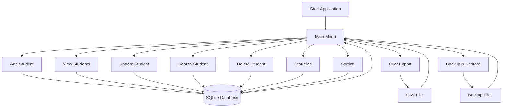

<div align="center">

# 🎓 Student Management System

### A Modular Student Management System built with **Python** & **SQLite**

<p align="center">

</p>

<p align="center">


</p>

</div>

---

# 📖 About the Project

The **Student Management System** is a modular command-line application developed using **Python** and **SQLite** to simplify student record management.

The project follows a clean and scalable architecture where each module has a single responsibility. It demonstrates database management, file handling, validation, modular programming, and clean code practices.

This project was built as a learning project to strengthen Python programming and software engineering concepts while creating a portfolio-ready application.

---

# ✨ Features

- ➕ Add Student Records
- 👀 View Student Details
- ✏️ Update Student Information
- 🔍 Search Students
- 🗑️ Delete Student Records
- 📊 Statistics Dashboard
- 📈 Sort Student Data
- 📄 Export Database to CSV
- 💾 Backup Database
- ♻️ Restore Database
- 📂 View Available Backups
- ❌ Delete Backup Files
- ✅ Input Validation
- 🗄️ SQLite Database Integration
- 🧩 Modular Project Structure

---

# 🛠️ Tech Stack

| Technology | Purpose |
|------------|---------|
| Python 3 | Programming Language |
| SQLite3 | Database |
| CSV | Data Export |
| shutil | Backup & Restore |
| os | File Management |
| time | Performance Measurement |
| Modular Programming | Code Organization |

---

# 🏗️ Project Architecture

```text
                   Student Management System
                             │
        ┌────────────────────┼────────────────────┐
        │                    │                    │
        ▼                    ▼                    ▼
   Validation           Business Logic        Database
   (validators)            (main.py)        (SQLite3)
        │                    │
        │                    │
        ▼                    ▼
  Helper Functions      Export & Backup
                             │
              ┌──────────────┴──────────────┐
              ▼                             ▼
        CSV Export                    Database Backup
```

---

# 📂 Project Structure

```text
student-management-system/
│
├── database/
│   ├── database.py
│   └── student.db
│
├── exports/
│   └── export_csv.py
│
├── backup/
│   └── backup_restore.py
│
├── utils/
│   ├── helpers.py
│   └── validator.py
│
├── backups/
│   └── *.db
│
├── config.py
├── main.py
├── README.md
└── LICENSE
```

---

# 📊 Current Project Progress

| Module | Status |
|---------|:------:|
| SQLite Database | ✅ |
| CRUD Operations | ✅ |
| Search | ✅ |
| Statistics Dashboard | ✅ |
| Sorting | ✅ |
| CSV Export | ✅ |
| Backup & Restore | ✅ |
| Validation | ✅ |
| Documentation | 🟡 |
| Logging | 🔜 |
| Unit Testing | 🔜 |

---

# 🚀 Current Version

```text
Version      : v2.0.0-alpha

Project Type : Command Line Application

Language     : Python

Database     : SQLite3

Architecture : Modular

Status       : Active Development
```

---

<div align="center">

### ⭐ If you like this project, consider giving it a Star!

**Made with ❤️ using Python**

</div>
---

# ⚙️ Installation

## Prerequisites

Before running the project, make sure you have:

- Python **3.10 or above**
- Git (Optional)
- VS Code (Recommended)

Check your Python version:

```bash
python --version
```

---

# 📥 Clone the Repository

```bash
git clone https://github.com/your-username/student-management-system-python.git
```

Move into the project directory:

```bash
cd student-management-system-python
```

---

# ▶️ Run the Application

Execute the following command:

```bash
python main.py
```

The application will automatically:

- Create the SQLite database (if it doesn't exist)
- Create the required tables
- Launch the Student Management System

---

# 📋 Main Menu

```text
========================================================================
                     STUDENT MANAGEMENT SYSTEM
========================================================================

1. Add Student
2. View Students
3. Update Student
4. Search Student
5. Delete Student
6. Statistics Dashboard
7. Sort Students
8. Export CSV
9. Backup & Restore
10. Exit
```

---

# 🌟 Core Features

## ➕ Add Student

Store complete student information including:

- Roll Number
- Name
- Date of Birth
- Department
- Year
- Section
- Parent Details
- Email
- Subject Marks
- Grade
- Status

---

## 👀 View Students

Displays every student stored in the database in a clean and readable format.

---

## ✏️ Update Student

Update any student information while keeping existing values by simply pressing **Enter**.

---

## 🔍 Search Students

Search students using:

- Roll Number
- Name
- Department
- Year

Supports partial matching for names and departments.

---

## 🗑 Delete Student

Safely delete student records with confirmation before deletion.

---

## 📊 Statistics Dashboard

Instantly view:

- Total Students
- Passed Students
- Failed Students
- Highest Average
- Lowest Average
- Class Average
- Grade Distribution

---

## 📈 Sorting

Sort records by:

- Roll Number
- Name
- Department
- Year
- Average Marks
- Grade
- Created Date

Supports both:

- Ascending Order
- Descending Order

---

## 📄 CSV Export

Export the complete student database into a CSV file.

Features:

- Automatic timestamp
- Dynamic column names
- UTF-8 Encoding
- Performance timing

---

## 💾 Backup & Restore

Database management features:

- Create Backup
- Restore Backup
- View Available Backups
- Delete Backup Files

Backups are stored safely inside the **backups/** directory.

---

# 🔄 Application Workflow


```mermaid
flowchart TD

A[Start Application]

A --> B[Main Menu]

B --> C[Add Student]
B --> D[View Students]
B --> E[Update Student]
B --> F[Search Student]
B --> G[Delete Student]
B --> H[Statistics]
B --> I[Sorting]
B --> J[CSV Export]
B --> K[Backup & Restore]

C --> L[(SQLite Database)]
D --> L
E --> L
F --> L
G --> L
H --> L
I --> L

J --> M[CSV File]

K --> N[Backup Files]

L --> B
M --> B
N --> B
```

---

# 📸 Screenshots

> Screenshots will be added in future releases.

Suggested screenshots:

- Main Menu
- Student Details
- Statistics Dashboard
- Search Result
- Sorting
- CSV Export
- Backup Menu

---

# 📚 Concepts Learned

This project helped in learning:

- Python Programming
- SQLite Database
- CRUD Operations
- Modular Programming
- Functions
- Exception Handling
- File Handling
- CSV Processing
- Database Backup
- Input Validation
- Clean Code Principles
- Performance Measurement

---

# 🗺️ Development Roadmap

## ✅ Completed

- SQLite Integration
- CRUD Operations
- Search Functionality
- Statistics Dashboard
- Student Sorting
- CSV Export
- Backup & Restore
- Input Validation
- Modular Architecture

---

## 🚧 In Progress

- Documentation
- Logging System

---

## 🔜 Upcoming Features

- Unit Testing
- Custom Exceptions
- PDF Report Generation
- Tkinter GUI
- Flask Web Version
- REST API
- MySQL Support

---

# 📈 Development Progress

```text
SQLite Database         ██████████ 100%

CRUD Operations         ██████████ 100%

Search                  ██████████ 100%

Statistics              ██████████ 100%

Sorting                 ██████████ 100%

CSV Export              ██████████ 100%

Backup & Restore        ██████████ 100%

Documentation           ████████░░ 80%

Logging                 ███░░░░░░░ 30%

Unit Testing            ░░░░░░░░░░ 0%
```

---

<div align="center">

## 🚀 Every feature was built to improve modularity, readability, and maintainability.

</div>