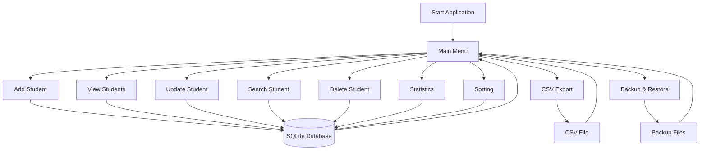
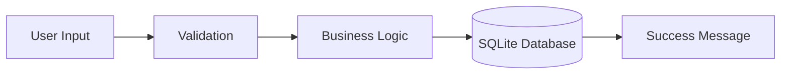
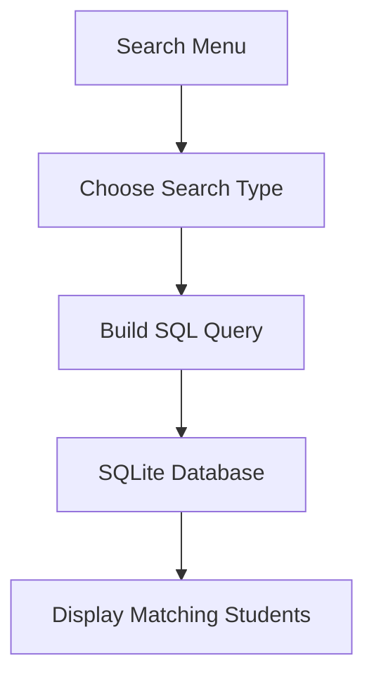
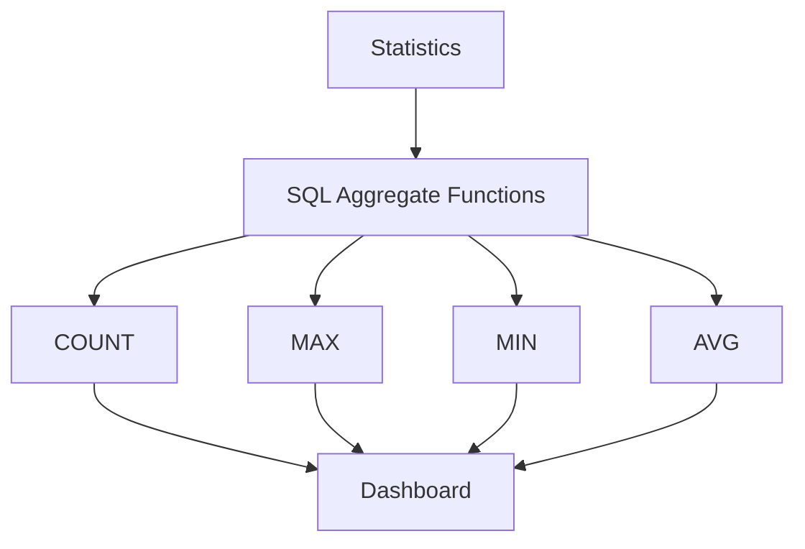
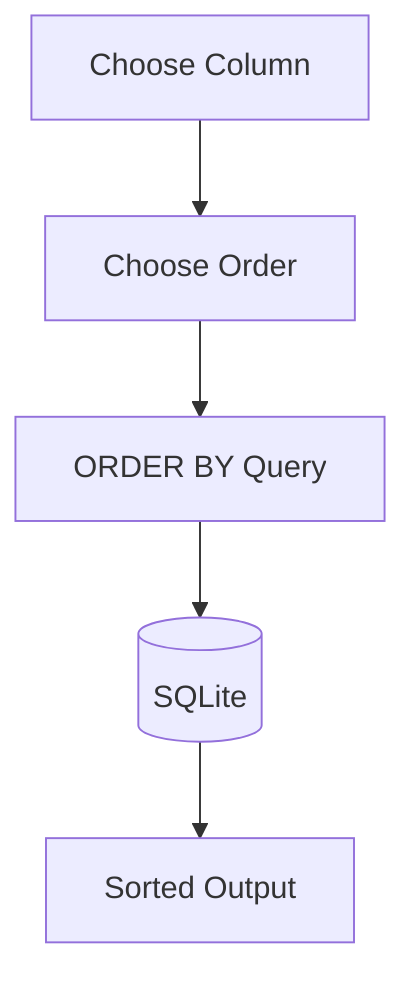
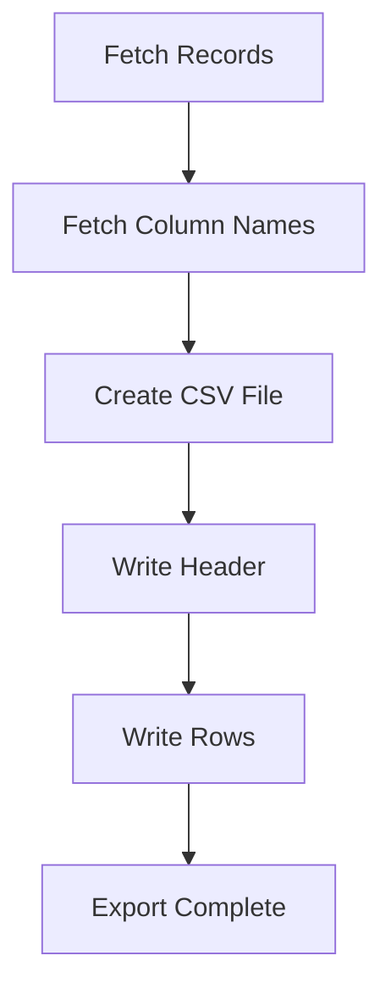
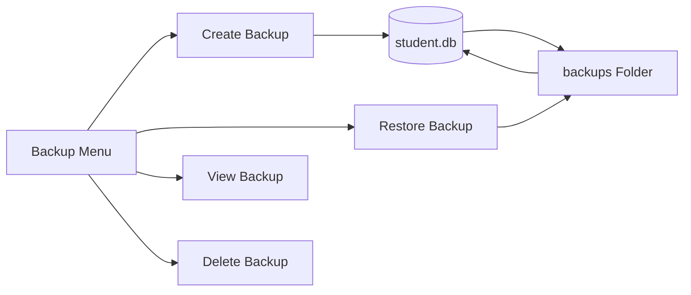

<div align="center">

# 🎓 Student Management System

### A Modular Student Management System built with **Python** & **SQLite**

<p align="center">

</p>

<p align="center">


</p>

</div>

---

# 📖 About the Project

The **Student Management System** is a modular command-line application developed using **Python** and **SQLite** to simplify student record management.

The project follows a clean and scalable architecture where each module has a single responsibility. It demonstrates database management, file handling, validation, modular programming, and clean code practices.

This project was built as a learning project to strengthen Python programming and software engineering concepts while creating a portfolio-ready application.

---

# ✨ Features

- ➕ Add Student Records
- 👀 View Student Details
- ✏️ Update Student Information
- 🔍 Search Students
- 🗑️ Delete Student Records
- 📊 Statistics Dashboard
- 📈 Sort Student Data
- 📄 Export Database to CSV
- 💾 Backup Database
- ♻️ Restore Database
- 📂 View Available Backups
- ❌ Delete Backup Files
- ✅ Input Validation
- 🗄️ SQLite Database Integration
- 🧩 Modular Project Structure

---

# 🛠️ Tech Stack

| Technology | Purpose |
|------------|---------|
| Python 3 | Programming Language |
| SQLite3 | Database |
| CSV | Data Export |
| shutil | Backup & Restore |
| os | File Management |
| time | Performance Measurement |
| Modular Programming | Code Organization |

---

# 🏗️ Project Architecture

```text
                   Student Management System
                             │
        ┌────────────────────┼────────────────────┐
        │                    │                    │
        ▼                    ▼                    ▼
   Validation           Business Logic        Database
   (validators)            (main.py)        (SQLite3)
        │                    │
        │                    │
        ▼                    ▼
  Helper Functions      Export & Backup
                             │
              ┌──────────────┴──────────────┐
              ▼                             ▼
        CSV Export                    Database Backup
```

---

# 📂 Project Structure

```text
student-management-system/
│
├── database/
│   ├── database.py
│   └── student.db
│
├── exports/
│   └── export_csv.py
│
├── backup/
│   └── backup_restore.py
│
├── utils/
│   ├── helpers.py
│   └── validator.py
│
├── backups/
│   └── *.db
│
├── config.py
├── main.py
├── README.md
└── LICENSE
```

---

# 📊 Current Project Progress

| Module | Status |
|---------|:------:|
| SQLite Database | ✅ |
| CRUD Operations | ✅ |
| Search | ✅ |
| Statistics Dashboard | ✅ |
| Sorting | ✅ |
| CSV Export | ✅ |
| Backup & Restore | ✅ |
| Validation | ✅ |
| Documentation | 🟡 |
| Logging | 🔜 |
| Unit Testing | 🔜 |

---

# 🚀 Current Version

```text
Version      : v2.0.0-alpha

Project Type : Command Line Application

Language     : Python

Database     : SQLite3

Architecture : Modular

Status       : Active Development
```

---

<div align="center">

### ⭐ If you like this project, consider giving it a Star!

**Made with ❤️ using Python**

</div>
---

# ⚙️ Installation

## Prerequisites

Before running the project, make sure you have:

- Python **3.10 or above**
- Git (Optional)
- VS Code (Recommended)

Check your Python version:

```bash
python --version
```

---

# 📥 Clone the Repository

```bash
git clone https://github.com/your-username/student-management-system-python.git
```

Move into the project directory:

```bash
cd student-management-system-python
```

---

# ▶️ Run the Application

Execute the following command:

```bash
python main.py
```

The application will automatically:

- Create the SQLite database (if it doesn't exist)
- Create the required tables
- Launch the Student Management System

---

# 📋 Main Menu

```text
========================================================================
                     STUDENT MANAGEMENT SYSTEM
========================================================================

1. Add Student
2. View Students
3. Update Student
4. Search Student
5. Delete Student
6. Statistics Dashboard
7. Sort Students
8. Export CSV
9. Backup & Restore
10. Exit
```

---

# 🌟 Core Features

## ➕ Add Student

Store complete student information including:

- Roll Number
- Name
- Date of Birth
- Department
- Year
- Section
- Parent Details
- Email
- Subject Marks
- Grade
- Status

---

## 👀 View Students

Displays every student stored in the database in a clean and readable format.

---

## ✏️ Update Student

Update any student information while keeping existing values by simply pressing **Enter**.

---

## 🔍 Search Students

Search students using:

- Roll Number
- Name
- Department
- Year

Supports partial matching for names and departments.

---

## 🗑 Delete Student

Safely delete student records with confirmation before deletion.

---

## 📊 Statistics Dashboard

Instantly view:

- Total Students
- Passed Students
- Failed Students
- Highest Average
- Lowest Average
- Class Average
- Grade Distribution

---

## 📈 Sorting

Sort records by:

- Roll Number
- Name
- Department
- Year
- Average Marks
- Grade
- Created Date

Supports both:

- Ascending Order
- Descending Order

---

## 📄 CSV Export

Export the complete student database into a CSV file.

Features:

- Automatic timestamp
- Dynamic column names
- UTF-8 Encoding
- Performance timing

---

## 💾 Backup & Restore

Database management features:

- Create Backup
- Restore Backup
- View Available Backups
- Delete Backup Files

Backups are stored safely inside the **backups/** directory.

---

# 🔄 Application Workflow


```mermaid
flowchart TD

A[Start Application]

A --> B[Main Menu]

B --> C[Add Student]
B --> D[View Students]
B --> E[Update Student]
B --> F[Search Student]
B --> G[Delete Student]
B --> H[Statistics]
B --> I[Sorting]
B --> J[CSV Export]
B --> K[Backup & Restore]

C --> L[(SQLite Database)]
D --> L
E --> L
F --> L
G --> L
H --> L
I --> L

J --> M[CSV File]

K --> N[Backup Files]

L --> B
M --> B
N --> B
```

---

# 📸 Screenshots

> Screenshots will be added in future releases.

Suggested screenshots:

- Main Menu
- Student Details
- Statistics Dashboard
- Search Result
- Sorting
- CSV Export
- Backup Menu

---

# 📚 Concepts Learned

This project helped in learning:

- Python Programming
- SQLite Database
- CRUD Operations
- Modular Programming
- Functions
- Exception Handling
- File Handling
- CSV Processing
- Database Backup
- Input Validation
- Clean Code Principles
- Performance Measurement

---

# 🗺️ Development Roadmap

## ✅ Completed

- SQLite Integration
- CRUD Operations
- Search Functionality
- Statistics Dashboard
- Student Sorting
- CSV Export
- Backup & Restore
- Input Validation
- Modular Architecture

---

## 🚧 In Progress

- Documentation
- Logging System

---

## 🔜 Upcoming Features

- Unit Testing
- Custom Exceptions
- PDF Report Generation
- Tkinter GUI
- Flask Web Version
- REST API
- MySQL Support

---

# 📈 Development Progress

```text
SQLite Database         ██████████ 100%

CRUD Operations         ██████████ 100%

Search                  ██████████ 100%

Statistics              ██████████ 100%

Sorting                 ██████████ 100%

CSV Export              ██████████ 100%

Backup & Restore        ██████████ 100%

Documentation           ████████░░ 80%

Logging                 ███░░░░░░░ 30%

Unit Testing            ░░░░░░░░░░ 0%
```

---

<div align="center">

## 🚀 Every feature was built to improve modularity, readability, and maintainability.

</div>
---

# 🗄️ Database Design

The project uses **SQLite3**, a lightweight, serverless relational database.

A single table named **student** stores all student information.

### Database Table

| Column | Type | Description |
|---------|------|-------------|
| id | INTEGER | Primary Key (Auto Increment) |
| roll_no | TEXT | Unique Roll Number |
| name | TEXT | Student Name |
| dob | TEXT | Date of Birth |
| department | TEXT | Department Name |
| year | INTEGER | Academic Year |
| section | TEXT | Section |
| father_name | TEXT | Father's Name |
| mother_name | TEXT | Mother's Name |
| parent_phone | TEXT | Parent Phone Number |
| email | TEXT | Email Address |
| python_marks | REAL | Python Marks |
| math_marks | REAL | Mathematics Marks |
| english_marks | REAL | English Marks |
| total | REAL | Total Marks |
| average | REAL | Average Marks |
| grade | TEXT | Student Grade |
| status | TEXT | Pass / Fail |
| created_at | TEXT | Record Creation Time |

---

# 🏛️ Database Schema

```text
+------------------------------------------------------+
|                    STUDENT TABLE                     |
+------------------------------------------------------+
| id (PK)                                              |
| roll_no (UNIQUE)                                     |
| name                                                 |
| dob                                                  |
| department                                           |
| year                                                 |
| section                                              |
| father_name                                          |
| mother_name                                          |
| parent_phone                                         |
| email                                                |
| python_marks                                         |
| math_marks                                           |
| english_marks                                        |
| total                                                |
| average                                              |
| grade                                                |
| status                                               |
| created_at                                           |
+------------------------------------------------------+
```

---

# 🏗️ Software Architecture

The project follows a **modular architecture**, where each module has a single responsibility.

```text
                    main.py
                       │
      ┌────────────────┼────────────────┐
      │                │                │
      ▼                ▼                ▼
 Database        Validation       Helper Functions
      │
      ▼
 SQLite Database
      │
      ├──────────────┐
      ▼              ▼
CSV Export     Backup & Restore
```

---

# 📂 Module Responsibilities

## 📌 main.py

Acts as the entry point of the application.

Responsible for:

- Displaying menus
- Taking user input
- Calling appropriate modules
- Coordinating application flow

---

## 📌 database.py

Handles every database operation.

Functions include:

- Database Initialization
- Create Table
- Add Student
- View Students
- Search Students
- Update Student
- Delete Student
- Statistics
- Sorting
- Column Retrieval

---

## 📌 validator.py

Responsible for validating user input.

Validation includes:

- Roll Number
- Name
- Department
- Date of Birth
- Phone Number
- Email
- Marks
- Year
- Section

---

## 📌 helpers.py

Contains reusable helper functions for taking validated user input.

Examples:

- Input Validation Loop
- Update Input Handler

---

## 📌 export_csv.py

Responsible for exporting student records into CSV format.

Features:

- Dynamic Column Headers
- UTF-8 Encoding
- Timestamped File Name
- Error Handling

---

## 📌 backup_restore.py

Responsible for database backup management.

Supports:

- Create Backup
- Restore Backup
- View Backup Files
- Delete Backup Files

Uses:

- shutil
- os
- time

---

# 🔄 CRUD Workflow


```mermaid
flowchart LR

A[User Input]

A --> B[Validation]

B --> C[Business Logic]

C --> D[(SQLite Database)]

D --> E[Success Message]
```

---

# 🔍 Search Workflow


```mermaid
flowchart TD

A[Search Menu]

A --> B[Choose Search Type]

B --> C[Build SQL Query]

C --> D[SQLite Database]

D --> E[Display Matching Students]
```

---

# 📊 Statistics Workflow


```mermaid
flowchart TD

A[Statistics]

A --> B[SQL Aggregate Functions]

B --> C[COUNT]

B --> D[MAX]

B --> E[MIN]

B --> F[AVG]

C --> G[Dashboard]

D --> G

E --> G

F --> G
```

---

# 📈 Sorting Workflow


```mermaid
flowchart TD

A[Choose Column]

A --> B[Choose Order]

B --> C[ORDER BY Query]

C --> D[(SQLite)]

D --> E[Sorted Output]
```

---

# 📄 CSV Export Workflow


```mermaid
flowchart TD

A[Fetch Records]

A --> B[Fetch Column Names]

B --> C[Create CSV File]

C --> D[Write Header]

D --> E[Write Rows]

E --> F[Export Complete]
```

---

# 💾 Backup & Restore Workflow


```mermaid
flowchart LR

A[Backup Menu]

A --> B[Create Backup]

A --> C[Restore Backup]

A --> D[View Backup]

A --> E[Delete Backup]

B --> F[(student.db)]

F --> G[backups Folder]

C --> G

G --> F
```

---

# 🧠 Design Principles

This project follows several software engineering principles.

### ✅ Modular Programming

Each module performs one dedicated task.

---

### ✅ Separation of Concerns

Database logic, validation, export, backup, and user interface are separated into different modules.

---

### ✅ Single Responsibility Principle (SRP)

Each Python file has one primary responsibility.

Examples:

- `database.py` → Database Operations
- `validator.py` → Input Validation
- `export_csv.py` → CSV Export
- `backup_restore.py` → Backup Management

---

### ✅ Code Reusability

Helper functions are reused throughout the project to avoid duplicate code.

---

### ✅ Error Handling

The application uses exception handling to prevent unexpected crashes during:

- Database Operations
- File Handling
- User Input
- CSV Export
- Backup Operations

---

# 📦 Project Statistics

| Metric | Value |
|---------|------:|
| Programming Language | Python |
| Database | SQLite3 |
| Modules | 6+ |
| CRUD Operations | 4 |
| Search Types | 4 |
| Sort Options | 7 |
| Statistics | 12 |
| CSV Export | Yes |
| Backup System | Yes |
| Restore System | Yes |
| Validation Functions | 9+ |

---

<div align="center">

## 💡 Clean Architecture + Modular Design = Maintainable Software

</div>
---

# 🚀 Project Development Journey

The **Student Management System** started as a simple CRUD application and gradually evolved into a modular, feature-rich management system.

Throughout development, the focus was not only on adding features but also on improving code quality, maintainability, and software design.

---

# 📅 Development Timeline

| Version | Features Added |
|----------|----------------|
| **v1.0** | SQLite Database Setup |
| **v1.1** | Add Student |
| **v1.2** | View Students |
| **v1.3** | Update Student |
| **v1.4** | Delete Student |
| **v1.5** | Search Functionality |
| **v1.6** | Statistics Dashboard |
| **v1.7** | Student Sorting |
| **v1.8** | CSV Export |
| **v1.9** | Backup & Restore System |
| **v2.0 (Current)** | Documentation & Project Refinement |

---

# 📜 Changelog

## v2.0.0-alpha

### ✨ Added

- Modular Project Architecture
- SQLite Database Management
- CRUD Operations
- Student Search
- Statistics Dashboard
- Student Sorting
- CSV Export
- Backup & Restore System
- Input Validation
- Dynamic Database Initialization

### 🔧 Improved

- Better Code Organization
- Modular Folder Structure
- Improved Error Handling
- Faster CSV Export
- Cleaner Console Output
- Improved User Experience

---

# 🎯 Future Enhancements

The following features are planned for future releases.

## 🔜 Logging System

- Log every application activity
- Error logging
- Timestamped log files

---

## 🔜 Unit Testing

Testing modules using Python's `unittest`.

Examples:

- Validator Tests
- Database Tests
- Helper Function Tests

---

## 🔜 PDF Report Generation

Generate printable student report cards.

Possible Libraries:

- ReportLab

---

## 🔜 Tkinter Desktop GUI

Transform the current CLI application into a graphical desktop application while reusing the existing backend.

---

## 🔜 Flask Web Application

Create a web-based Student Management System using:

- Flask
- HTML
- CSS
- SQLite

---

## 🔜 REST API

Develop REST APIs for:

- Add Student
- Update Student
- Delete Student
- Search Student

This will make the backend reusable for desktop, web, or mobile applications.

---

## 🔜 MySQL / PostgreSQL Support

Replace SQLite with enterprise-grade databases.

---

# 📚 Skills Demonstrated

This project demonstrates practical knowledge of:

### Python

- Functions
- Modules
- Exception Handling
- File Handling
- Lists
- Dictionaries
- Loops
- String Manipulation

---

### Database

- SQLite3
- SQL Queries
- CRUD Operations
- Aggregate Functions
- Sorting
- Searching

---

### Software Engineering

- Modular Programming
- Separation of Concerns
- Single Responsibility Principle
- Code Reusability
- Maintainability

---

### File Management

- CSV Export
- Database Backup
- Database Restore
- File Deletion
- Directory Management

---

### Development Tools

- Visual Studio Code
- Git
- GitHub

---

# 📊 Project Achievements

✅ Fully Functional Student Management System

✅ Modular Codebase

✅ SQLite Database Integration

✅ Input Validation

✅ Search & Sorting

✅ Statistics Dashboard

✅ CSV Export

✅ Backup & Restore

✅ Professional Documentation

---

# 🎓 Learning Outcomes

Developing this project helped strengthen my understanding of:

- Database Design
- Python Programming
- Software Architecture
- SQL
- File Handling
- Error Handling
- Project Organization
- Clean Code Practices
- Documentation
- Git & GitHub Workflow

---

# 📈 Current Project Status

```text
Overall Completion

███████████████████████████████████████████████████ 98%

Completed Modules

███████████████████████████████████████████████████ 100%

Documentation

██████████████████████████████████████░░░░░░░░░░░░ 80%

Upcoming Features

███░░░░░░░░░░░░░░░░░░░░░░░░░░░░░░░░░░░░░░░░░░░░░░░ 20%
```

---

# 🏆 Project Highlights

- 📦 Modular Folder Structure
- 🗄️ SQLite Database
- 📊 Statistics Dashboard
- 🔍 Dynamic Search
- 📈 Student Sorting
- 📄 CSV Export
- 💾 Backup & Restore
- ✅ Strong Input Validation
- 🛠️ Clean Code Architecture
- 📚 Well Documented

---

# 🌟 Vision

The goal of this project is not only to manage student records but also to serve as a learning platform for applying software engineering principles in Python.

Future versions will introduce graphical interfaces, web technologies, APIs, automated testing, and cloud database support while maintaining the same modular architecture.

---

<div align="center">

## 🚀 "Great software is built one feature at a time."

**Thank you for exploring this project!**

</div>

---

# 🤝 Contributing

Contributions are always welcome!

If you'd like to improve this project:

1. Fork the repository
2. Create a new branch

```bash
git checkout -b feature/your-feature
```

3. Commit your changes

```bash
git commit -m "Add your feature"
```

4. Push your branch

```bash
git push origin feature/your-feature
```

5. Open a Pull Request

Please make sure your code follows the existing project structure and coding style.

---

# 🐛 Reporting Issues

Found a bug?

Have a feature request?

Please open an issue on GitHub with:

- Clear title
- Steps to reproduce
- Expected behavior
- Screenshots (if applicable)

Your feedback is greatly appreciated.

---

# 📜 License

This project is licensed under the **MIT License**.

You are free to:

- ✅ Use
- ✅ Modify
- ✅ Distribute
- ✅ Learn from the project

Please include the original license when redistributing.

---

# 👨‍💻 About the Developer

### Soumith J. V.

🎓 Computer Science Engineering Student

💻 Passionate about

- Python Development
- Software Engineering
- Database Systems
- Artificial Intelligence
- Automation
- Full Stack Development

Currently learning:

- Advanced Python
- Data Structures & Algorithms
- SQL
- Flask
- Software Architecture

---

# 🛠️ Technologies Used

<p align="center">


</p>

---

# 📈 Repository Highlights

- 🗄️ SQLite Database
- 🧩 Modular Architecture
- 📊 Statistics Dashboard
- 🔍 Smart Search
- 📈 Student Sorting
- 📄 CSV Export
- 💾 Backup & Restore
- ✅ Input Validation
- ⚡ Performance Measurement
- 📚 Clean Documentation

---

# 📂 Repository Structure

```text
student-management-system-python/
│
├── backup/
├── backups/
├── database/
├── exports/
├── utils/
│
├── config.py
├── main.py
├── README.md
├── LICENSE
└── .gitignore
```

---

# 📌 Project Statistics

| Category | Details |
|-----------|----------|
| Language | Python |
| Database | SQLite3 |
| Architecture | Modular |
| Interface | Command Line |
| Status | Active Development |
| Version | v2.0.0-alpha |
| License | MIT |

---

# 🌱 Future Goals

The roadmap for future versions includes:

- 📝 Logging System
- 🧪 Unit Testing
- 📄 PDF Report Cards
- 🖥️ Tkinter Desktop GUI
- 🌐 Flask Web Application
- 🔗 REST API
- 🐬 MySQL / PostgreSQL Support
- ☁️ Cloud Deployment

---

# 🙏 Acknowledgements

Special thanks to:

- Python Community
- SQLite Developers
- Open Source Contributors
- GitHub
- Everyone who provides feedback and suggestions

Their tools and resources made this project possible.

---

# ⭐ Support the Project

If you found this project helpful:

🌟 Star this repository

🍴 Fork it

📢 Share it with others

Every contribution and star helps motivate future improvements.

---

<div align="center">

# 🎓 Student Management System

### Built with ❤️ using Python & SQLite

---

### ⭐ Thank you for visiting this repository! ⭐

*"Code. Learn. Improve. Repeat."*

<br>


</div>